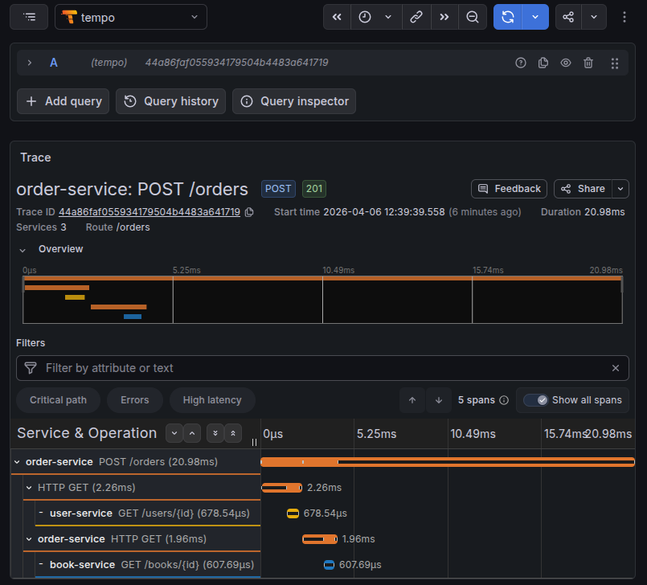
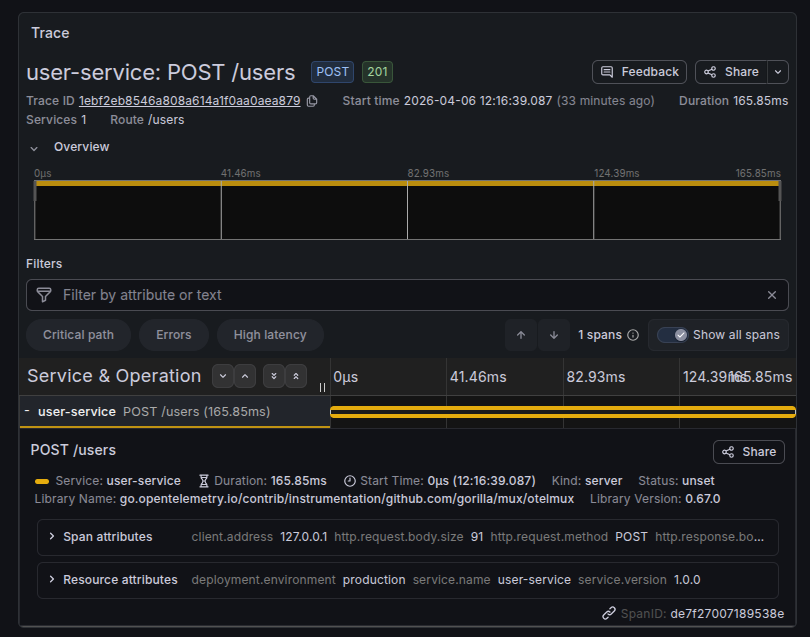
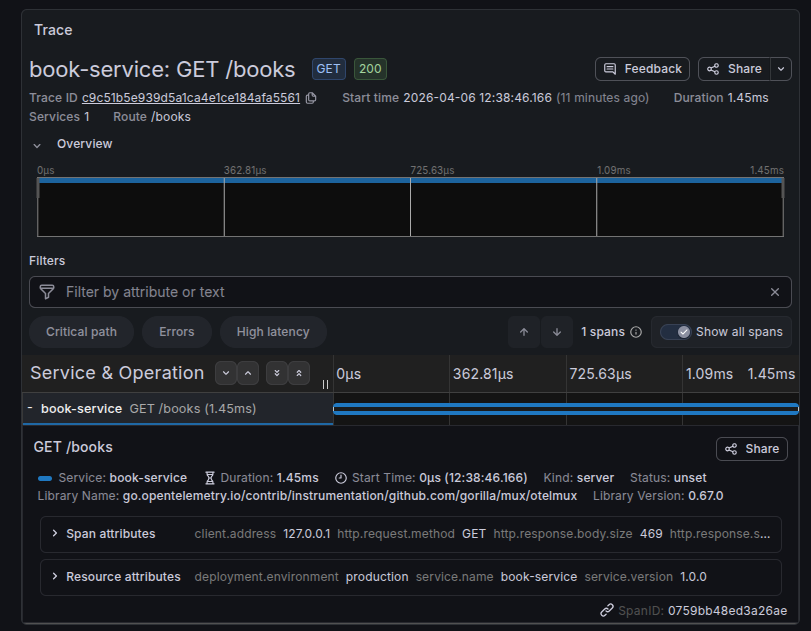

# Implement tracing for task3

## Install Tempo 

```sh
$ helm repo add grafana https://grafana.github.io/helm-charts
$ helm repo update grafana
```

check for version of tempo

```sh
$ helm search repo grafana/tempo
NAME                            CHART VERSION   APP VERSION     DESCRIPTION
grafana/tempo                   1.23.0          2.8.0           Grafana Tempo Single Binary Mode
grafana/tempo-distributed       1.42.0          2.8.0           Grafana Tempo in MicroService mode
grafana/tempo-vulture           0.8.0           2.6.1           Grafana Tempo Vulture - A tool to monitor Tempo...
```

install tempo with custom values

```yaml
tempo:
  resources:
    limits:
      cpu: 1000m
      memory: 1Gi
    requests:
      cpu: 300m
      memory: 200Mi
  storage:
    trace:
      backend: local
      local:
        path: /var/tempo/traces
  
persistence:
  enabled: true
  size: 2Gi
  storageClassName: ""

```

```sh
$ helm install tempo grafana/tempo --namespace monitoring --values values.yaml
```

## Install OTEL Operator 

cert manager must be installed to use otel operator.

custom values for the otel operator 

```yml
manager:
  collectorImage:
    repository: ghcr.io/open-telemetry/opentelemetry-collector-releases/opentelemetry-collector-k8s

  resources:
    requests:
      cpu: 100m
      memory: 128Mi
    limits:
      cpu: 200m
      memory: 256Mi
  extraArgs:
  - --enable-go-instrumentation=true
  
admissionWebhooks:
  certManager:
    enabled: true
```

```sh
$ helm repo add open-telemetry https://open-telemetry.github.io/opentelemetry-helm-charts
$ helm install open-telemetry-operator open-telemetry/opentelemetry-operator --namespace monitoring -f values.yaml
```

### Create OTEL Collector 

Collector will receive telemetry data, process it and send it to our tempo backend.

```yml
apiVersion: opentelemetry.io/v1beta1
kind: OpenTelemetryCollector
metadata:
  name: otel-collector
  namespace: monitoring
spec:
  config: 
    receivers:
      otlp:
        protocols:
          grpc:
            endpoint: 0.0.0.0:4317
          http:
            endpoint: 0.0.0.0:4318

    processors:
      batch:

    exporters:
      otlp:
        endpoint: grafana-tempo:4317
        tls:
          insecure: true

    service:
      pipelines:
        traces:
          receivers: [otlp]
          processors: [batch]
          exporters: [otlp]

```

```sh
$ kubectl apply -f otel-collector.yaml
```

## Enable Auto Instrumentation

we can enable instrumentation of our services by using one of the ways.
- enabling auto instrumentation using instrumentation cr and annotations.
- manually using opentelemetry sdk
- using sidecar containers directly in our pod spec

### Instrumentation Custom Resource

instrumentation manifest file.

```yml
apiVersion: opentelemetry.io/v1alpha1
kind: Instrumentation
metadata:
  name: otel-instrumentation
  namespace: default
spec:
  exporter:
    endpoint: http://otel-collector-collector.monitoring.svc.cluster.local:4317

  propagators:
    - tracecontext
    - baggage

  sampler:
    type: parentbased_traceidratio
    argument: "1"

  go:
    image: ghcr.io/open-telemetry/opentelemetry-go-instrumentation/autoinstrumentation-go:latest
```

We will then create this custom resource in the same namespace of our applications.

```sh
$ kubectl apply -f instrumentation.yaml
```

Then we need to add annotations to our `pod spec` to enable auto instrumentation.

```yml
annotations:
  instrumentation.opentelemetry.io/inject-go: "true"
  instrumentation.opentelemetry.io/otel-go-auto-target-exe: "<path-to-binary>"
```

Then we can either restart our pods or install if new.

### Sidecar
we can add sidecar container to our pods.

```yml
- name: autoinstrumentation-go
  image: otel/autoinstrumentation-go
  imagePullPolicy: IfNotPresent
  env:
    - name: OTEL_GO_AUTO_TARGET_EXE
      value: /user-service
    - name: OTEL_EXPORTER_OTLP_ENDPOINT
      value: "http://<address_in_network>:4318"
    - name: OTEL_SERVICE_NAME
      value: "user-service"
  securityContext:
    runAsUser: 0
    privileged: true
```

`shareProcessNamespace: true` should be enabled.

we can now redeploy our helm charts. we should see 2 containers running per pod.

## Configure Grafana

we can then configure grafana to get traces from tempo and view traces of different services.

```sh
$ kubectl port-forward svc/kube-prometheus-stack-grafana 9000:80 --address 10.0.0.5 -n monitoring
```

### Order service



### User service



### Book service

